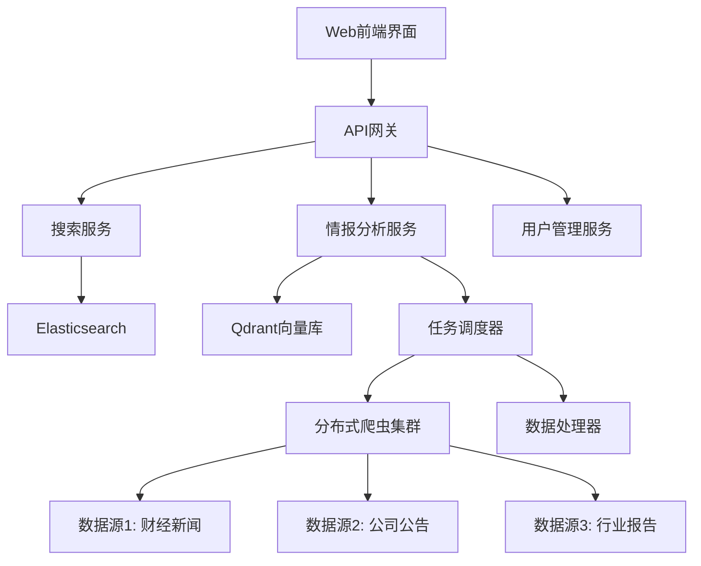

# 投资情报搜索引擎 - Qsou Intelligence Engine

一个专为量化交易设计的自部署投资情报搜索引擎，具备像Google一样的通用搜索能力和专业情报分析师的智能采集整理功能。

## 🎯 项目概览

### 核心功能
- **🔍 通用搜索**: 像Google一样提供投资资讯的自由搜索
- **🤖 智能情报收集**: 根据指定主题自动搜集、分析并整理信息
- **📊 向量知识库**: 支持语义搜索和智能推荐
- **⚡ 实时数据**: 新闻<5分钟，公告<1分钟延迟
- **🛡️ 法律合规**: 严格遵循数据抓取法律法规

### 技术特色
- **100%开源技术栈**: 无第三方付费依赖
- **🐳 一键Docker部署**: 完整容器化解决方案
- **🔄 微服务架构**: 可独立扩展各个功能模块
- **📈 高性能设计**: 支持大规模并发和海量数据

## 📋 项目文档

### 核心规划文档
- **[PROJECT_MEMORY.md](./PROJECT_MEMORY.md)** - 项目长期记忆，技术栈和架构决策
- **[规划蓝图](./plan%20report/20250127120000_投资情报搜索引擎系统.md)** - 完整的技术架构和实施计划

### 专项方案文档  
- **[legal-compliance-guide.md](./legal-compliance-guide.md)** - 法律合规指南和风险防控
- **[tech-stack-design.md](./tech-stack-design.md)** - 详细技术栈设计方案
- **[implementation-roadmap.md](./implementation-roadmap.md)** - 7阶段实施路线图

## 🏗️ 技术架构



## 🛠️ 核心技术栈

| 层级 | 技术选择 | 用途说明 |
|------|----------|----------|
| **前端** | Next.js + TypeScript + Ant Design | 现代化用户界面 |
| **后端** | FastAPI + Python | 高性能API服务 |
| **搜索引擎** | Elasticsearch 8.x | 全文搜索和索引 |
| **向量数据库** | Qdrant | 语义搜索和相似度计算 |
| **数据采集** | Scrapy + Scrapy-Redis | 分布式网络爬虫 |
| **任务队列** | Celery + Redis | 异步任务处理 |
| **数据库** | PostgreSQL + MongoDB | 结构化和非结构化数据存储 |
| **AI/NLP** | Hugging Face Transformers | 文本分析和向量化 |
| **容器化** | Docker + Docker Compose | 一键部署和运维 |
| **监控** | Prometheus + Grafana | 系统监控和报警 |

## 🚀 快速开始

### ⚡ 一键快速启动
```bash
# 克隆项目
git clone <repository-url>
cd Qsou

# 运行快速启动脚本
python scripts/quick_start.py
```
📖 **详细指南**: [QUICK_START.md](QUICK_START.md)

### 环境要求
- Python 3.8+
- Java 11+ (Elasticsearch需要)
- PostgreSQL
- Redis  
- Elasticsearch 8.x (含IK中文分词器)
- Qdrant向量数据库
- 可用内存 >= 8GB
- 可用存储 >= 20GB

### 开发环境搭建
```bash
# 完整环境搭建
make dev-setup

# 验证环境
make verify

# 初始化数据存储
make init

# 启动开发服务
make dev-api        # API服务 (端口8000)
make dev-frontend   # 前端服务 (端口3000)
```

### 验证部署
- 前端界面: http://localhost:3000
- API文档: http://localhost:8000/docs  
- Elasticsearch: http://localhost:9200
- Qdrant Dashboard: http://localhost:6333/dashboard

## 📊 实施计划

### 7个开发阶段 (8-12周)

| 阶段 | 时间 | 主要任务 | 交付物 |
|------|------|----------|--------|
| **阶段一** | 1-2周 | 基础设施搭建 | Docker环境、数据库配置 |
| **阶段二** | 3-4周 | 数据采集系统 | 分布式爬虫、反爬虫机制 |
| **阶段三** | 5-6周 | 数据处理索引 | NLP处理、向量化、索引构建 |
| **阶段四** | 7-8周 | 搜索引擎核心 | 全文搜索、语义搜索API |
| **阶段五** | 9-10周 | 智能情报分析 | 主题监控、自动报告生成 |
| **阶段六** | 11周 | 前端用户界面 | Web界面、用户管理 |
| **阶段七** | 12周 | 部署与监控 | 生产环境、监控运维 |

## 🛡️ 法律合规保障

- ✅ 严格遵循robots.txt协议
- ✅ 合理访问频率控制 (≤1req/s)
- ✅ 仅采集公开可访问数据
- ✅ 完整的合规监控体系
- ✅ 数据来源透明可追溯

## 📈 性能指标

- **搜索响应时间**: <200ms
- **数据更新延迟**: 新闻<5min，公告<1min
- **搜索结果相关性**: >85%
- **系统可用性**: >99.9%
- **并发支持**: 10000+ 搜索请求/秒

## 🎯 下一步行动

1. **确认项目需求**: 核实功能需求和性能指标
2. **选择实施方式**: 
   - 完整自主开发 (8-12周)
   - 分阶段实施 (可先开发MVP版本)
   - 技术指导支持
3. **环境准备**: 服务器资源、域名、SSL证书
4. **开始开发**: 从阶段一基础设施搭建开始

## 📞 技术支持

项目包含完整的技术方案、实施指南和合规框架，可以立即开始实施。如需技术指导或定制开发支持，请随时联系。

---

**注意**: 本方案严格遵循"所见即可用"原则，所有组件都基于真实的开源技术和完整的实现方案，无任何模拟数据或虚拟组件。
# Qsou
