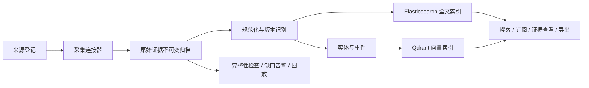

# Qsou：自主投资数据底座

Qsou 用于持续采集、保存和使用自己掌握的投资数据。它直接连接已登记的数据源，保留可追溯、可验证、可回放的历史证据，并在这份数据之上提供搜索、监控和分析能力。

搜索是使用数据的入口，不是数据来源本身。项目的长期价值来自持续积累的数据历史、来源关系、版本变化、实体映射和用户反馈，而不是依赖传统搜索引擎返回什么。

## 项目目标

Qsou 要建立的是一套不依赖传统搜索引擎才能持续运转的数据资产：

- 直接接入监管机构、交易所、公司公告、政府公开数据和可信媒体等明确来源。
- 保存原始响应、来源、时间、内容版本和处理版本，保证每条结果可以回到证据。
- 从原始档案重建结构化文档、全文索引、向量索引和模型派生结果。
- 让用户搜索自有资料库、订阅变化、查看版本、纠正数据并开放导出。
- 把采集延迟、来源停更、解析失败和覆盖缺口明确展示出来。

## 产品边界

- 优先完整覆盖一组高价值来源，不以覆盖整个互联网为目标。
- 传统搜索引擎可以用于发现线索，但不能成为正式数据链的硬依赖。
- Elasticsearch、Qdrant 和 AI 模型都是可替换的派生能力，不是唯一事实源。
- “可以访问”不等于“可以无限保存和分发”；每个来源必须单独登记权利与保留边界。
- 不把未经验证的性能、实时性、覆盖率或模型准确率写成项目承诺。

## 文档入口

| 文档 | 用途 |
|---|---|
| [自主数据资产设计指导](./docs/data-sovereignty-design-guidelines.md) | 项目方向、数据权威、来源治理、时间模型与验收标准 |
| [数据流架构](./docs/data-flow-architecture.md) | 目标数据流以及当前实现差距 |
| [基线部署](./docs/baseline-deployment.md) | 部署 API、前端、采集器并验证数据资产闭环 |
| [爬虫插件指南](./docs/crawler-plugins.md) | 数据源连接器的开发与验证方式 |
| [法律合规指南](./docs/legal-compliance-guide.md) | 来源接入和数据使用的合规检查参考 |
| [技术栈设计](./docs/tech-stack-design.md) | 历史技术选型与实现参考，不定义数据权威 |
| [本地开发环境](./docs/local-development-setup.md) | 开发环境安装与运行 |
| [快速开始](./docs/QUICK_START.md) | 当前项目启动入口 |
| [项目长期记忆](./PROJECT_MEMORY.md) | 已确认方向、既有决策和历史问题索引 |

## 目标数据架构


```mermaid
flowchart LR
    A[来源登记] --> B[采集连接器]
    B --> C[原始证据不可变归档]
    C --> D[规范化与版本识别]
    D --> E[实体与事件]
    D --> F[Elasticsearch 全文索引]
    E --> G[Qdrant 向量索引]
    F --> H[搜索 / 订阅 / 证据查看 / 导出]
    G --> H
    C --> I[完整性检查 / 缺口告警 / 回放]
```

## 当前实现与主要差距

**Observed in code：** 当前基线已经在 Scrapy 解析之前保存原始响应，按来源、逻辑文档和内容版本登记标准文档，并把待处理状态持久化到 SQLite。持续采集器随部署启动并公开真实运行状态；FastAPI 提供受认证保护的自有数据搜索、来源状态、证据查看、开放导出和回放接口；Next.js 以同域 HttpOnly 会话提供“搜索”和“数据资产”两个用户入口。API 只存在于项目内部网络。Elasticsearch、Qdrant 与 Celery 是可选派生能力，关闭后基线仍可运行。

**仍待完成：** 当前回放从已保存标准文档开始，尚未完成仅凭原始响应重新执行解析器并重建所有派生层的恢复演练；来源登记也尚未自动证明分页、编号和时间窗口完整性。多实例存储、用户知识资产、实体事件层和订阅仍在基线之外。

因此，不能把 Elasticsearch 视为项目主存储，也不能仅凭文档数量声明来源已经完整覆盖。

## 快速开始

### 可部署基线
```bash
cp deploy/baseline.env.example deploy/baseline.env
# 在专用部署主机或 CI 构建，不在资源敏感的共享开发机执行
docker compose --env-file deploy/baseline.env up -d --build
```
远程部署前必须在 `deploy/baseline.env` 中设置独立登录凭据、签名密钥和采集周期。完整步骤、宿主机验证和数据备份边界见 [基线部署](./docs/baseline-deployment.md)。历史完整开发栈说明见 [快速开始](./docs/QUICK_START.md) 和 [本地开发环境](./docs/local-development-setup.md)。

### 验证部署
- 登录入口: http://localhost:3000/login
- 搜索入口: http://localhost:3000
- 数据资产: http://localhost:3000/data

生产环境只发布 Web 端口。API 文档仅在本地调试模式提供，不属于公网产品入口。

## 当前设计优先级

1. 来源登记、稳定身份、时间模型和原始证据归档。
2. 幂等采集、缺口检测、死信、回补、版本保留和回放。
3. 可从标准文档重建的全文/向量索引，以及证据可追溯的搜索与订阅。
4. 实体图谱、事件抽取、用户反馈和可替换的 AI 分析。

具体任务状态以 SoloMap 路线图为准；README 不重复维护阶段完成情况。
