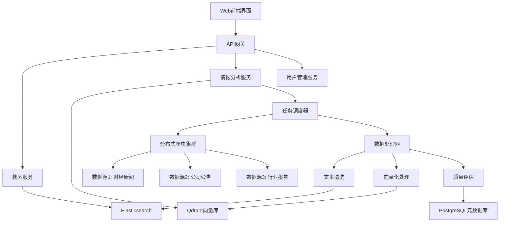

# 规划蓝图：投资情报搜索引擎系统
*   **状态**: [规划中]

## 1. 核心目标与验收标准 (Core Objective & Acceptance Criteria)

### a. 核心目标 (Core Objective)
构建一个完整的、自部署的投资情报搜索引擎，为量化交易提供可靠的实时数据源。系统具备双重智能：既能像Google一样提供通用搜索服务，又能像专业情报分析师一样主动搜集、分析特定投资主题的信息并构建向量知识库。

### b. 验收标准 (Acceptance Criteria)
*   `[ ]` **通用搜索功能**: 用户可以在Web界面输入关键词，获得相关的投资资讯搜索结果，响应时间<200ms
*   `[ ]` **智能情报收集**: 用户可以指定投资主题（如"新能源汽车行业分析"），系统自动搜集相关信息并整理成结构化报告
*   `[ ]` **向量知识库**: 所有收集的信息自动向量化存储，支持语义搜索和相似内容推荐
*   `[ ]` **实时数据更新**: 重要财经新闻延迟<5分钟，上市公司公告延迟<1分钟
*   `[ ]` **法律合规运行**: 所有数据采集严格遵循robots.txt和网站服务条款，有完整的合规监控机制
*   `[ ]` **Docker一键部署**: 通过docker-compose一条命令即可完整部署所有服务
*   `[ ]` **API接口完善**: 提供完整的RESTful API，支持第三方系统集成

## 2. 现状分析与复用性尽职调查 (Current State Analysis & Reuse Due Diligence)

### a. 复用性尽职调查
*   **搜索关键词**: `elasticsearch`, `scrapy`, `vector database`, `financial data crawler`, `investment intelligence`
*   **搜索范围**: 开源社区、GitHub热门项目、技术社区最佳实践
*   **发现与结论**:
    *   **Elasticsearch**: 成熟的开源搜索引擎，有丰富的金融插件生态
    *   **Scrapy生态**: Scrapy-Redis支持分布式爬虫，Scrapy-Splash处理JavaScript
    *   **Qdrant**: 专业向量数据库，比Pinecone等商业方案更适合自部署
    *   **现有财经爬虫**: 存在一些开源财经数据爬虫，但缺乏集成的搜索引擎解决方案
    *   **结论**: 需要整合多个开源组件，构建完整的端到端解决方案

### b. 潜在影响分析
*   **法律风险**: 需要建立完善的robots.txt遵循机制和访问频率控制
*   **技术复杂度**: 涉及多个技术栈，需要严格的服务治理和监控
*   **数据质量**: 需要建立多层数据清洗和质量评估机制
*   **扩展性**: 采用微服务架构，便于后续功能扩展和性能优化

## 3. 技术方案与架构设计 (Technical Approach & Architecture Design)

### a. 整体架构
采用微服务架构，各组件松耦合，便于独立扩展和维护。

### b. 核心技术栈
*   **数据采集层**: Scrapy + Scrapy-Redis (分布式爬虫)
*   **数据存储层**: Elasticsearch (搜索) + Qdrant (向量) + PostgreSQL (元数据) + Redis (缓存)
*   **数据处理层**: Celery + Hugging Face Transformers (文本分析和向量化)
*   **API服务层**: FastAPI (高性能Python Web框架)
*   **前端展示层**: Next.js + TypeScript (现代化前端)
*   **基础设施层**: Docker + Docker Compose + Nginx (容器化部署)

### c. 架构图

### d. 数据流设计
1. **爬虫采集**: 多源并行采集财经数据
2. **实时处理**: 数据清洗、去重、格式标准化
3. **智能分析**: NLP提取关键信息、情感分析、主题分类
4. **多重存储**: 原文存储到Elasticsearch，向量存储到Qdrant
5. **用户查询**: 支持关键词搜索和语义搜索

## 4. 任务分解与上下文锚点 (Task Breakdown & Context Anchors)

### 阶段一: 基础设施搭建 (状态: `进行中`)
*   `[ ]` 1.1: 搭建Docker开发环境，配置docker-compose.yml
*   `[ ]` 1.2: 部署Elasticsearch集群，配置索引模板
*   `[ ]` 1.3: 部署Qdrant向量数据库，配置向量集合
*   `[ ]` 1.4: 搭建Redis和PostgreSQL数据库
*   `[ ]` 1.5: **验证点**: 所有基础服务正常启动，健康检查通过 **[里程碑检查点]**

### 阶段二: 数据采集系统 (状态: `未开始`)
*   `[ ]` 2.1: 搭建Scrapy-Redis分布式爬虫框架
*   `[ ]` 2.2: 开发财经新闻爬虫 (新浪财经、东方财富等)
*   `[ ]` 2.3: 开发上市公司公告爬虫 (上交所、深交所)
*   `[ ]` 2.4: 实现反爬虫对抗机制 (IP轮换、用户代理轮换)
*   `[ ]` 2.5: 建立数据质量监控和异常报警
*   `[ ]` 2.6: **验证点**: 爬虫稳定运行24小时，数据采集无异常 **[里程碑检查点]**

### 阶段三: 数据处理与索引 (状态: `未开始`)
*   `[ ]` 3.1: 开发数据清洗管道 (去重、格式化、内容提取)
*   `[ ]` 3.2: 集成中文NLP处理 (分词、实体识别、情感分析)
*   `[ ]` 3.3: 实现文本向量化 (使用中文金融BERT模型)
*   `[ ]` 3.4: 建立Elasticsearch索引策略和映射
*   `[ ]` 3.5: 实现增量更新机制
*   `[ ]` 3.6: **验证点**: 数据处理管道完整运行，搜索索引正确构建 **[里程碑检查点]**

### 阶段四: 搜索引擎核心 (状态: `未开始`)
*   `[ ]` 4.1: 开发FastAPI搜索服务
*   `[ ]` 4.2: 实现全文搜索API (关键词、短语、布尔查询)
*   `[ ]` 4.3: 实现语义搜索API (向量相似度搜索)
*   `[ ]` 4.4: 实现搜索结果排序和高亮
*   `[ ]` 4.5: 添加搜索建议和自动补全
*   `[ ]` 4.6: **验证点**: 搜索API功能完整，性能达到<200ms要求 **[里程碑检查点]**

### 阶段五: 智能情报分析 (状态: `未开始`)
*   `[ ]` 5.1: 开发主题监控服务
*   `[ ]` 5.2: 实现智能内容聚合算法
*   `[ ]` 5.3: 开发自动报告生成功能
*   `[ ]` 5.4: 实现趋势分析和异常检测
*   `[ ]` 5.5: 建立投资主题知识图谱
*   `[ ]` 5.6: **验证点**: 能够自动生成指定主题的结构化分析报告 **[里程碑检查点]**

### 阶段六: 前端用户界面 (状态: `未开始`)
*   `[ ]` 6.1: 搭建Next.js前端项目结构
*   `[ ]` 6.2: 开发搜索界面 (搜索框、结果展示、筛选器)
*   `[ ]` 6.3: 开发情报监控界面 (主题管理、报告查看)
*   `[ ]` 6.4: 实现用户认证和权限管理
*   `[ ]` 6.5: 优化响应式设计和用户体验
*   `[ ]` 6.6: **验证点**: 前端功能完整，与后端API无缝集成 **[里程碑检查点]**

### 阶段七: 部署与监控 (状态: `未开始`)
*   `[ ]` 7.1: 完善Docker生产环境配置
*   `[ ]` 7.2: 搭建Prometheus + Grafana监控系统
*   `[ ]` 7.3: 实现日志聚合和分析 (ELK Stack)
*   `[ ]` 7.4: 建立自动化部署流水线
*   `[ ]` 7.5: 性能优化和压力测试
*   `[ ]` 7.6: **验证点**: 系统稳定运行，监控指标正常 **[最终验证点]**

## 5. 风险评估与应对策略 (Risk Assessment & Mitigation Plan)

### 法律合规风险
*   **风险**: 数据抓取可能违反网站服务条款或法律法规
*   **应对**: 
    - 严格遵循robots.txt协议
    - 实施合理的访问频率限制 (每域名最大1req/s)
    - 建立白名单机制，仅抓取明确允许的数据源
    - 定期审查数据来源的使用条款更新

### 技术性能风险
*   **风险**: 大规模数据处理可能导致系统性能瓶颈
*   **应对**:
    - 采用分布式架构，横向扩展能力
    - 实施多级缓存策略 (Redis + CDN)
    - 建立详细的性能监控和预警机制
    - 预留充足的硬件资源余量

### 数据质量风险
*   **风险**: 爬虫数据可能包含噪声、重复或低质量内容
*   **应对**:
    - 建立多层数据清洗管道
    - 实现智能去重算法
    - 建立内容质量评分机制
    - 人工审核关键数据源

### 反爬虫对抗风险
*   **风险**: 目标网站可能实施反爬虫措施
*   **应对**:
    - 实现IP轮换池 (代理服务)
    - 模拟真实用户行为模式
    - 实施动态User-Agent轮换
    - 建立爬虫状态监控和自动恢复机制

### 系统可用性风险
*   **风险**: 单点故障可能导致服务中断
*   **应对**:
    - 所有关键服务实现高可用部署
    - 建立自动故障转移机制
    - 实施定期备份策略
    - 建立快速故障恢复流程
